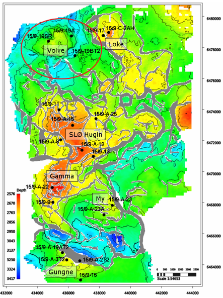
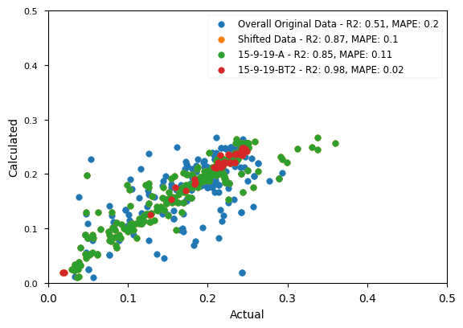
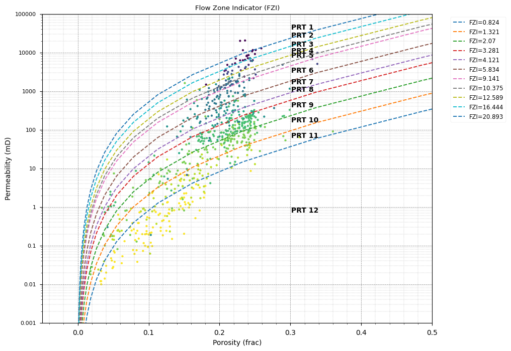
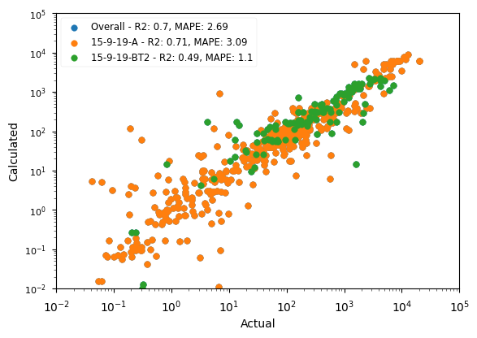
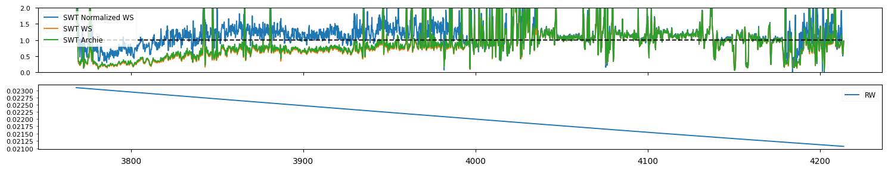
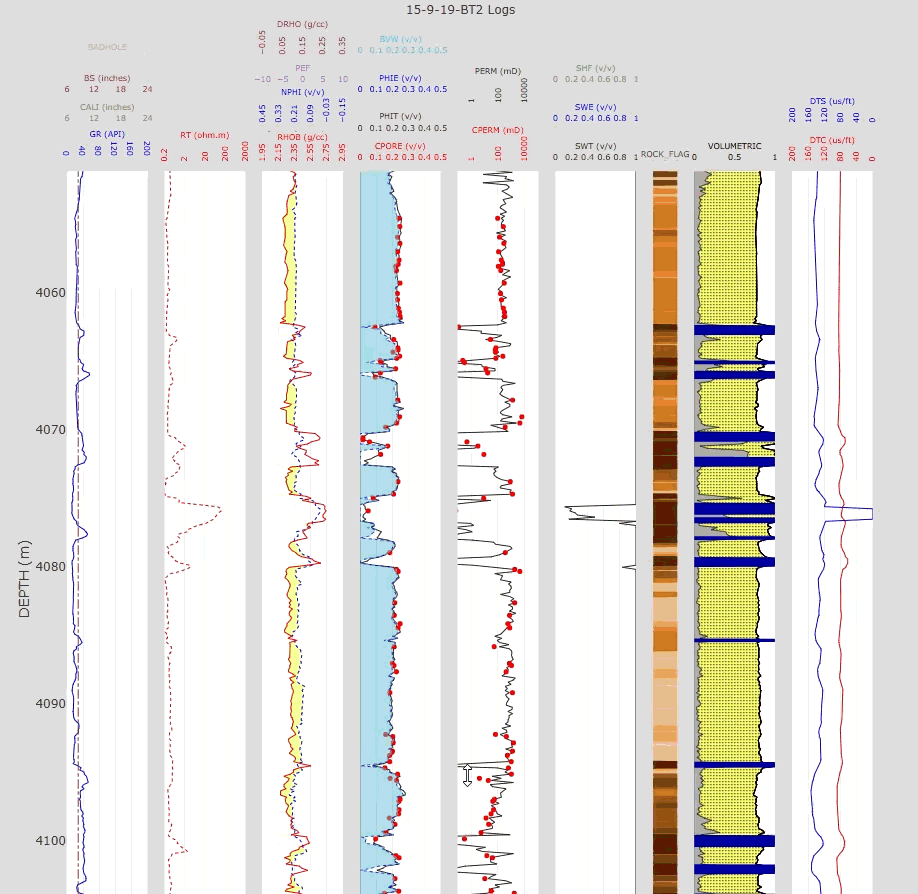

# Petrophysical Analysis on the Volve Dataset

This project presents a comprehensive petrophysical analysis of the Volve dataset, leveraging the `quick-pp` library. The workflow demonstrates an end-to-end process, from data ingestion and quality control to advanced rock typing and permeability modeling using machine learning. The analysis is structured across several Jupyter notebooks, each tackling a specific stage of the petrophysical interpretation.

The primary goal is to build a robust and predictive reservoir characterization model by integrating well logs, core data, and geological information.

### Field Background

The Volve field, located in block 15/9, central part of the North Sea, five kilometres north of the Sleipner Øst field. The water depth is 80 metres. Volve was discovered in 1993, and the plan for development and operation (PDO) was approved in 2005. The field was developed with a jack-up processing and drilling facility. The vessel "Navion Saga" was used for storing stabilised oil. The production started in 2008.

Volve produced oil from sandstone of Middle Jurassic age in the Hugin Formation with depositional environment of near shore, shallow marine sandstones with the occasional influence of continental fluviodeltaic conditions. The reservoir is at a depth of 2700-3100 metres. The western part of the structure is heavily faulted and communication across the faults is uncertain. 

Volve's hydrocarbons were sourced from the world-class Upper Jurassic Draupne Formation, an organic-rich shale that generated oil and gas in the deeper parts of the basin. These hydrocarbons migrated upwards into the Volve structure, where they were trapped by an effective seal composed of the overlying Heather and Draupne Formation shales.

The field was discovered in May 1993 by the wildcat well 15/9-19 SR, which confirmed the presence of oil in the Hugin Formation. Following this success, two appraisal sidetracks, 15/9-19 A and 15/9-19 BT2, were drilled to delineate the size of the accumulation and define the fluid contacts. This appraisal campaign was critical for assessing the field's commercial viability, and all three initial wells were plugged and abandoned after successfully gathering the required data for development planning.

The field was produced with water injection for pressure support. The oil was exported by tankers and the rich gas was transported to the Sleipner A facility for further export. Volve was shut down in 2016, and the facility was removed in 2018.

### Analysis Workflow

The analysis is divided into five main stages, each covered by a dedicated Jupyter notebook:

1.  **`01_data_handler.ipynb`**: Data loading, cleaning, and consolidation from various sources (LAS, Excel) into a unified project file.
2.  **`02_lithology_porosity.ipynb`**: Log conditioning and calculation of fundamental petrophysical properties like lithology (VCLAY) and porosity (PHIT).
3.  **`03_rock_typing_perm.ipynb`**: Advanced reservoir characterization using the Flow Zone Indicator (FZI) for rock typing and machine learning to predict permeability.
4.  **`04_saturation.ipynb`**: Estimation of water saturation using the Archie equation and saturation height functions.
5.  **`05_ressum_plot.ipynb`**: Generation of final reservoir summary reports and interactive log plots.

### 1. Data Ingestion and Preparation

This notebook focuses on consolidating disparate data sources into a unified and analysis-ready format.

*   **Well Log Loading**: Loaded and aggregated well log data from multiple LAS files for the key wells in the Volve field.
*   **Core Data Integration**: Imported Routine Core Analysis (RCA) data (porosity and permeability) from Excel files for wells `15-9-19-A` and `15-9-19-BT2`. The core data was carefully depth-matched and merged with the log data.
*   **Facies Data Integration**: Processed and merged lithofacies interpretations from Excel files to provide geological context.
*   **Project Creation**: All consolidated data was saved into a single `quick-pp` project file (`VOLVE.qppp`), ensuring streamlined and consistent data access for all subsequent analysis steps.

### 2. Lithology and Porosity Estimation

This notebook covers the fundamental petrophysical evaluation, establishing the foundation for consequence analysis and modelling.

*   **Log Conditioning**: Raw logs were conditioned including badhole flagging and applying hydrocarbon corrections to the neutron (NPHI) and density (RHOB) logs, which is critical for accurate lithology and porosity calculations in hydrocarbon-bearing zones.
*   **Lithology Estimation**: A standard Sand-Shale (`ss`) model was applied to estimate the volume of clay (`VCLAY`) from the gamma-ray log, followed by using the corrected NPHI and RHOB logs to determine mineral volumes.
*   **Porosity Calculation**: Total porosity (`PHIT`) was calculated using the neutron-density crossplot method. The log-derived porosity was then benchmarked against core porosity (`CPORE`).

Automated depth correction using `dtw-python` package has been implemented on the core data. The following comparison shows a strong correlation, with an **R² score of 0.87**, validating the accuracy of our porosity model.

*A crossplot of log-derived total porosity (PHIT) vs. core porosity (CPORE) for well 15-9-19-A, demonstrating a strong linear relationship.*

### 3. Rock Typing and Permeability Prediction

This stage moves beyond conventional analysis to classify the reservoir into distinct rock types and build a highly accurate permeability model.

*   **Rock Typing with FZI**: The Flow Zone Indicator (FZI) method was applied to core data to define hydraulic flow units (HFUs). By analyzing the relationship between porosity and permeability, we identified distinct rock types that share similar fluid flow characteristics. Cutoffs were established using cumulative probability and Lorenz plots, resulting in **12 rock types** (`ROCK_FLAG`).

*   **Machine Learning for Prediction**:
    *   **Rock Type Classification**: A classification model was trained to predict the `ROCK_FLAG` from standard well logs (`GR`, `NPHI`, `RHOB`, `RT`). This enables the propagation of rock types to uncored intervals and wells.
    *   **FZI Regression**: A regression model was trained to predict `log(FZI)` using the same logs, augmented with the predicted `ROCK_FLAG` as a feature. This hybrid approach leverages both the continuous nature of logs and the discrete power of rock types.

*Porosity-permeability crossplot showing core data segregated by FZI-derived rock types.*

*   **Permeability Modeling**: The predicted FZI, combined with porosity, was used to calculate a continuous permeability curve (`PERM`) using the FZI equation. This physics-informed machine learning approach is far more robust than a simple porosity-permeability transform.

The final permeability model was benchmarked against core permeability (`CPERM`), achieving **R² score of 0.7**.

*A crossplot of model-predicted permeability (PERM) vs. core permeability (CPERM), showing a strong predictive performance across several orders of magnitude.*

### 4. Water Saturation Estimation

This notebook estimates water saturation (`SWT`), a critical parameter for quantifying hydrocarbon volumes.

*   **Methodology**: The water saturation was calculated using the **Normalized Waxman-Smits equation**, a fundamental model for shaly sand formations.
*   **Parameter Estimation**:
    *   **Formation Water Resistivity (Rw)**: Estimated based on a formation water salinity of 37,000 ppm.
    *   **Cementation Factor (m)**: A **Pickett plot** was used to determine the appropriate cementation factor, which was found to be **1.9**.
*   **Calculation**: The `normalized_waxman_smits_saturation` function was used to compute a continuous water saturation curve. The results were then compared against the Archie and Waxman-Smits.

### 5. Reservoir Summary and Final Plots

This notebook consolidates all petrophysical calculations to generate a comprehensive reservoir summary and final plots for all wells in the Volve field.

*   **Cutoff Analysis**: An automated `cutoffs_analysis` was performed to determine the optimal petrophysical cutoffs for defining net reservoir pay.
*   **Reservoir Summary**: A detailed reservoir summary (`ressum`) was calculated for each well and geological zone, quantifying key properties like net thickness, average porosity, and hydrocarbon pore volume. The results were compiled and saved to a CSV file for easy access and further analysis.
*   **Final Log Plots**: Comprehensive log plots were generated for each well using `plotly_log`, visualizing all the key input and calculated curves (GR, Resistivity, NPHI, RHOB, Porosity, Permeability, Saturation, and Lithology). These plots provide a final, integrated view of the reservoir characterization and were saved as interactive HTML files.
*   **Cross-Well QA/QC**: Finally, a `quick_compare` plot was generated to visually inspect the consistency of the key logs across all wells, ensuring a high level of confidence in the final interpretation.

*Result example from one of the analysed wells: 15-9-19-BT2*

### Key Insights and Conclusion

This project successfully demonstrates a modern, integrated petrophysical workflow on the public Volve dataset. By combining fundamental petrophysics with machine learning, we developed a robust and consistent reservoir characterization model.

*   **Validated Porosity Model**: The log-derived porosity model was successfully validated against core data, providing a reliable foundation for subsequent calculations.
*   **Permeability Prediction**: The use of FZI-based rock typing and machine learning proved critical for achieving an accurate permeability prediction. This method effectively captures the geological heterogeneity that controls fluid flow.
*   **Scalable Workflow**: The methodology allows for the confident propagation of reservoir properties from cored to uncored wells for further analysis and modelling.

The final results offer a detailed, data-driven characterization of the Hugin Formation reservoir, demonstrating a practical approach for integrating geological concepts with modern data science techniques.
