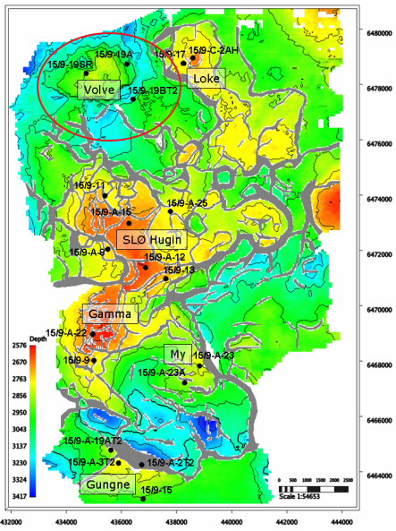

# Petrophysical Analysis on the Volve Dataset

This project presents a quick petrophysical analysis of the Volve dataset, leveraging the `quick-pp` library. The workflow spans from initial data ingestion and preparation to petrophysical property estimation, including lithology, porosity, permeability, and water saturation. The analysis is structured across several Jupyter notebooks, each tackling a specific stage of the interpretation process.

### Geological Background

The Volve field, located in block 15/9 of the Norwegian North Sea, is a structural trap on the eastern edge of the South Viking Graben. The trap consists of a westward-tilted fault block, or horst, that formed during Jurassic rifting events. This geological structure created the necessary geometry to accumulate hydrocarbons that migrated into the area.

The primary reservoir is the Middle Jurassic Hugin Formation, a high-quality sandstone with excellent porosity and permeability, deposited in a shallow marine environment. This reservoir contained light oil (around 40° API) with a substantial gas cap. A secondary, lower-quality reservoir also exists in the deeper Sleipner Formation.

Volve's hydrocarbons were sourced from the world-class Upper Jurassic Draupne Formation, an organic-rich shale that generated oil and gas in the deeper parts of the basin. These hydrocarbons migrated upwards into the Volve structure, where they were trapped by an effective seal composed of the overlying Heather and Draupne Formation shales.

The field was discovered in May 1993 by the wildcat well 15/9-19 A, which confirmed the presence of both oil and gas in the Hugin Formation. Following this success, two appraisal sidetracks, 15/9-19 BT2 and 15/9-19 SR, were drilled to delineate the size of the accumulation and define the fluid contacts. This appraisal campaign was critical for assessing the field's commercial viability, and all three initial wells were plugged and abandoned after successfully gathering the required data for development planning.

### 1. Data Ingestion and Preparation (`01_data_handler.ipynb`)

The initial phase focused on consolidating various data sources into a unified project structure.

*   **Data Loading**: Well log data from multiple LAS files were read and aggregated.
*   **Core Data Integration**: Routine core analysis (RCA) data (porosity and permeability) from Excel files for wells `15-9-19-A` and `15-9-19-BT2` were loaded and merged with the log data based on depth.
*   **Facies Data Integration**: Lithofacies information from Excel files was processed and merged with the log data, providing geological context for subsequent analysis.
*   **Project Creation**: All consolidated data was saved into a single `quick-pp` project file (`VOLVE.qppp`) for streamlined access in later stages.

### 2. Lithology and Porosity Estimation (`02_lithology_porosity.ipynb`)

This notebook demonstrates the fundamental petrophysical evaluation for a single well (`15-9-19-A`).

*   **Log Conditioning**: The log data was pre-processed, which included badhole flagging and hydrocarbon correction on neutron (NPHI) and density (RHOB) logs to ensure accurate lithology and porosity calculations.

*   **Lithology Estimation**: A Sand-Shale (`ss`) model was used to estimate the volume of sand and clay (`VSAND`, `VCLAY`) from the corrected NPHI and RHOB logs.
*   **Porosity Calculation**: Total porosity (`PHIT`) was calculated using the neutron-density crossplot method. The results were benchmarked against available core porosity (`CPORE`), showing a good correlation with an R² score of 0.81.

### 3. Rock Typing and Permeability Prediction (`03_rock_typing_fzi.ipynb`)

This stage focused on classifying the reservoir into rock types to better characterize permeability.

*   **Rock Type Definition**: The Flow Zone Indicator (FZI) method was used on core data to define hydraulic flow units. Cutoffs were determined using cumulative probability and Lorenz plots, resulting in 12 distinct rock types (`ROCK_FLAG`).
*   **Machine Learning for Rock Typing**:
    *   A classification model was trained to predict `ROCK_FLAG` from standard well logs (`GR`, `NPHI`, `RHOB`, `RT`). This allows rock type prediction in uncored intervals and wells.
    *   A regression model was trained to predict `log(FZI)` using the same logs plus the predicted `ROCK_FLAG`.
*   **Permeability Modeling**:
    *   The predicted FZI was used to calculate a continuous permeability curve (`PERM`). This method proved superior to traditional porosity-permeability transforms.
    *   The final permeability model, when benchmarked against core permeability (`CPERM`) on well `15-9-19-A`, achieved a high R² score of 0.81.

### Summary

This analysis successfully demonstrates an end-to-end petrophysical workflow on the Volve dataset. By integrating core data, log data, and machine learning, it produces a robust and consistent reservoir characterization across multiple wells. The use of the FZI-based rock typing model was critical for achieving accurate permeability predictions, a key parameter for reservoir simulation and development planning.