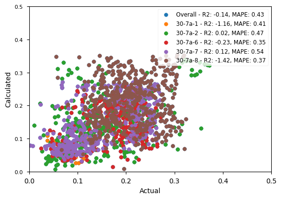
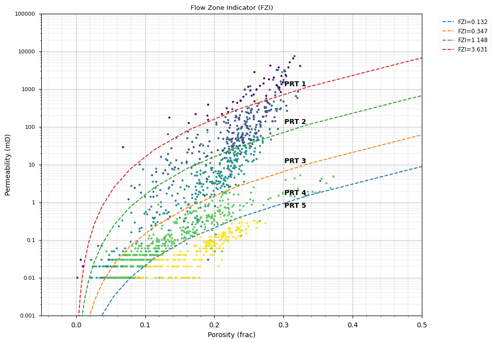
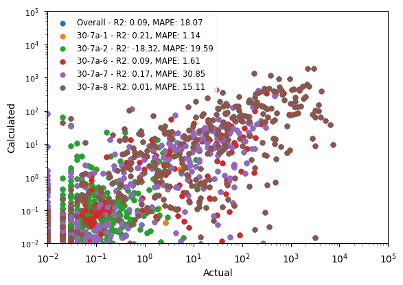

# Petrophysical Analysis of a North Sea Block 30/7

This project presents a comprehensive petrophysical analysis of a well from the Norwegian North Sea block 30/7, leveraging the `quick-pp` library. The workflow demonstrates an end-to-end process, from data ingestion and quality control to advanced rock typing and permeability modeling using machine learning. The analysis is structured across several Jupyter notebooks, each tackling a specific stage of the petrophysical interpretation.

### Field Background

Block 30/7a is situated in the UK's Central Graben, a structurally complex region where its geology is fundamentally controlled by halokinesis (salt movement). The deep-seated Permian Zechstein salt has created a large anticlinal structure known as the J-Ridge, which forms the primary trap for the block's major fields, Judy and Jasmine. This structural setting has led to the formation of high-pressure, high-temperature (HPHT) reservoirs, making it a challenging but highly productive area.

The block benefits from a world-class petroleum system, with the prolific Late Jurassic Kimmeridge Clay serving as the primary source rock for its gas-condensate accumulations. These hydrocarbons are trapped in multiple stacked reservoirs with diverse depositional environments (DOE), including the Triassic continental sandstones of the Skagerrak Formation, the high-quality Jurassic shallow marine sands of the Fulmar Formation, and the Paleocene deepwater turbidite systems of the Forties Sandstone. The entire sequence is capped by a thick, effective regional seal of Cretaceous and Cenozoic mudstones, which securely contains the hydrocarbons within the J-Ridge structure.

### Analysis Workflow

The analysis is divided into five main stages, each covered by a dedicated Jupyter notebook:

1.  **`01_data_handler.ipynb`**: Data loading, cleaning, and consolidation from various sources (LAS, Excel) into a unified project file.
2.  **`02_lithology_porosity.ipynb`**: Log conditioning and calculation of fundamental petrophysical properties like lithology (VCLAY, VCALC) and porosity (PHIT).
3.  **`03_rock_typing_perm.ipynb`**: Advanced reservoir characterization using the Flow Zone Indicator (FZI) for rock typing and machine learning to predict permeability.
4.  **`04_saturation.ipynb`**: Estimation of water saturation using the Normalized Waxman Smit's equation.
5.  **`05_ressum_plot.ipynb`**: Generation of final reservoir summary reports and interactive log plots.

### 1. Data Ingestion and Preparation

This notebook focuses on consolidating data sources into a unified and analysis-ready format.

*   **Well Log Loading**: Loaded and aggregated well log data from LAS files for the key well(s) in the study.
*   **Core Data Integration**: Imported Routine Core Analysis (RCA) data (porosity and permeability) from available core reports. The core data was depth-matched and merged with the log data.
*   **Tops Data Integration**
*   **Project Creation**: All consolidated data was saved into a single `quick-pp` project file (`30-7.qppp`), ensuring streamlined and consistent data access for all subsequent analysis steps.

* **Wells** being analysed:
    1. **30/7a-1** (Mar 1981)
    2. **30/7a-2** (Jan 1983)
    5. **30/7a-6** (Feb 1985)
    6. **30/7a-7** (Mar 1986)
    6. **30/7a-8** (Jan 1989)
    
    

### 2. Lithology and Porosity Estimation

This notebook performs essential log conditioning and computes the primary reservoir properties: lithology and porosity.

*   **Volume of Clay (VCLAY)**: The volume of clay is estimated primarily from the Neutron Porosity (NPHI) and Bulk Density (RHOB) and supplemented by Gamma Ray (GR) log. The calculation is calibrated against clean and shale end points.
*   **Lithology Determination**: Given the chalk reservoir, the volume of calcite (VCALC) is determined, using Neutron-Density cross plot to account for the primary mineralogy alongside clay content.
*   **Porosity Calculation (PHIT)**: Total porosity (PHIT) is calculated from the density log, corrected for the effects of clay and matrix mineralogy. The resulting porosity log is then calibrated against the available core porosity measurements to ensure accuracy.

* **Validation against CPORE**

    
    - `TODO:`
        - Check whether the reported values are at ambient or overburden condition.
        - Perform core depth correction.
        - Align the interpretation with the core description.

### 3. Rock Typing and Permeability Modeling

This stage focuses on advanced reservoir characterization by identifying hydraulic flow units and building a predictive model for permeability.

*   **Rock Typing**: The Flow Zone Indicator (FZI) method is used to classify the reservoir into distinct rock types, or "hydraulic flow units." This method leverages the relationship between core porosity and permeability to identify zones with similar fluid flow characteristics.
    

*   **Permeability Modeling**: A machine learning model is trained to predict permeability (PERM) along the entire logged interval.
    *   **Features**: The model uses a combination of raw well logs (e.g., GR, RHOB, NPHI) and derived petrophysical properties (VCLAY, PHIT, FZI) as input features.
    *   **Training**: The model is trained and validated using the core permeability data as the ground truth.
    *   **Prediction**: Once trained, the model generates a continuous, high-resolution permeability log, which is crucial for understanding reservoir performance, especially in a low-matrix-permeability system like this chalk reservoir.
    

* **Validation against CPERM**

    
    - `TODO:`
        - Check whether the reported values are at ambient or overburden condition.
        - Perform core depth correction.
        - Align the interpretation with the core description.

### 4. Water Saturation

Water saturation (SWT) is calculated to determine the hydrocarbon content of the reservoir. 
Key evaluation challenges include Low-Resistivity Low-Contrast (LRLC) pay zones, high irreducible water saturation (Swirr), and a fracture-dominated flow system.

*   **Waxman Smit's Equation** equation is used to estimate SWT. 
* One critical edit was made to the RT log for 3, 4 and 7 wells whereby it is divided by 10, assuming decimal place error. This is because the given RT logs seems higher by a factor of ten which resulted in low SWT values in the water leg (using the reported formation water salinity of 100,000 ppm). 

* The formation water Rw is estimated at 0.028 ohmm based on formation water salinity of 100,000 ppm at formation temperature of 123 degC. 
* `TODO:` Revisit the cementation and saturation exponent, m and n, which are currently assumed 2 for both. Assuming fix m and n values introduces uncertainty and does not address the heterogeneity of the formation.

### 5. Reservoir Summary and Visualization

The final notebook consolidates all calculated results into a comprehensive reservoir summary and generates visualizations for interpretation.

*   **Pay Summary (Cutoffs)**: Reservoir pay is quantified by applying petrophysical cutoffs for VCLAY, PHIT, and SWT. This process identifies the net reservoir and net pay intervals.
    

*   **Log Plot Generation**: A final, interactive log plot is generated using `quick-pp`. This plot displays key input logs and calculated curves (VCLAY, PHIT, SWT, PERM), along with core data. Below is an result example from one of the analysed wells:
    

    Stick plot focusing on the Tor formation:
    

### 6. Conclusion

This work demonstrates an end-to-end petrophysical workflow for a complex, naturally fractured chalk reservoir in the Norwegian North Sea.

Key insights from the analysis include:
*   Application of the Flow Zone Indicator (FZI) method to delineate hydraulic flow units, providing a framework for understanding fluid flow in a low-matrix-permeability system.
*   The development of a machine learning model that predicts a continuous permeability log. This overcomes the limitations of sparse core data and provides a high-resolution input for reservoir simulation and performance prediction.
* ...
